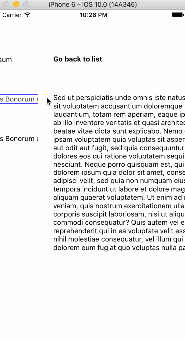

**App.js**
```js
import React from 'react';
import { Provider } from 'react-redux';
import { RootSceneContainer } from 'react-native-renavigate';

import store from './store';
import routes from './routes';

const posts = [
  {
    id: 1,
    text: 'Lorem ipsum dolor sit amet',
    title: 'Lorem Ipsum'
  },
  {
    id: 2,
    text: 'Sed ut perspiciatis unde omnis iste natus error',
    title: 'de Finibus Bonorum et Malorum 1.10.32'
  },
  {
    id: 3,
    text: 'At vero eos et accusamus et iusto odio',
    title: 'de Finibus Bonorum et Malorum 1.10.33'
  }
];

export default function index() {
  return (
    <Provider store={store}>
      <RootSceneContainer
      initialRoute={routes.LIST({ posts })}
      routes={routes}
      />
    </Provider>
  );
}
```

**Store.js**
```js
import { createStore, combineReducers } from 'redux';
import { reducer as navigation } from 'react-native-renavigate';

const reducers = combineReducers({
  navigation
});

export default createStore(reducers);

```

**Routes.js**
```js
import PostDetailContainer from './PostDetailContainer';
import PostListContainer from './PostListContainer';

export default {
  DETAIL: (params) => ({
    component: PostDetailContainer,
    params
  }),
  LIST: (params) => ({
    component: PostListContainer,
    params
  })
};

```

**PostListContainer**
```js
import React, { Component } from 'react';
import { ScrollView, TouchableOpacity, Text } from 'react-native';
import { connect } from 'react-redux';
import { actionCreators } from 'react-native-renavigate';

class PostListContainer extends Component {

  renderPostDetail = (post) => {
    this.props.dispatch(actionCreators.push.DETAIL(post));
  }

  render() {
    return (
      <ScrollView>
        {
          this.props.posts.map((post) => {
            return (
              <TouchableOpacity onPress={() => this.renderPostDetail(post)}>
                <Text>{ post.title }</Text>
              </TouchableOpacity>
            );
          })
        }
      </ScrollView>
    );
  }
}

export default connect()(PostListContainer);
```

**PostDetailContainer.js**
```js
import React, { Component } from 'react';
import { Text, TouchableOpacity, View } from 'react-native';
import { connect } from 'react-redux';
import { actionCreators } from 'react-native-renavigate';

class PostDetailContainer extends Component {

  backToList = () => {
    this.props.dispatch(actionCreators.pop());
  }

  render() {
    return (
      <View>
        <TouchableOpacity onPress={this.backToList}>
          <Text>Go back to list</Text>
        </TouchableOpacity>
        <Text>
          { this.props.text }
        </Text>
      </View>
    );
  }
}

export default connect()(PostDetailContainer);
```
